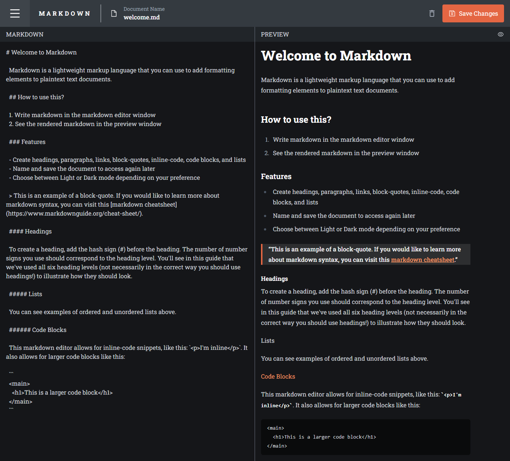

# Frontend Mentor - In-browser markdown editor solution

This is a solution to the [In-browser markdown editor challenge on Frontend Mentor](https://www.frontendmentor.io/challenges/inbrowser-markdown-editor-r16TrrQX9). Frontend Mentor challenges help you improve your coding skills by building realistic projects.

## Table of contents

- [Overview](#overview)
  - [The challenge](#the-challenge)
  - [Screenshot](#screenshot)
  - [Links](#links)
- [Built with](#built-with)
- [Author](#author)
- [Commands](#commands)

## Overview

### The challenge

Users should be able to:

- Create, Read, Update, and Delete markdown documents
- Name and save documents to be accessed as needed
- Edit the markdown of a document and see the formatted preview of the content
- View a full-page preview of the formatted content
- View the optimal layout for the app depending on their device's screen size
- See hover states for all interactive elements on the page
- Use localStorage to save the current state in the browser that persists when the browser is refreshed

### Screenshot



### Links

- Live Site URL: [https://previewmd.netlify.app/](https://previewmd.netlify.app/)

## Built with

- Semantic HTML5 markup
- Highlight.js - Syntax Higlighting
- [Marked.js](https://marked.js.org/) - Parse Markdown
- Tailwind CSS
- Vite React - JS library
- [React Toastify](https://github.com/fkhadra/react-toastify#readme) - For Notifications
- [React Modal](https://github.com/reactjs/react-modal)
- [Zustand](https://docs.pmnd.rs/zustand/getting-started/introduction) - Global State management

## Author

- LinkedIn - [Peter Uadiale](https://www.linkedin.com/in/peter-o-uadiale-69541a19a/)
- Twitter - [Peter Uadiale](https://twitter.com/peter_uadiale)

## Commands

### Project setup

```
npm install
```

### Compiles and minifies for production

```
npm run build
```

### Lints and fixes files

```
npm run lint
```

### Run Project

```
npm run dev
```
